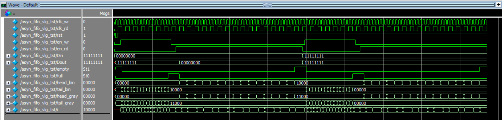
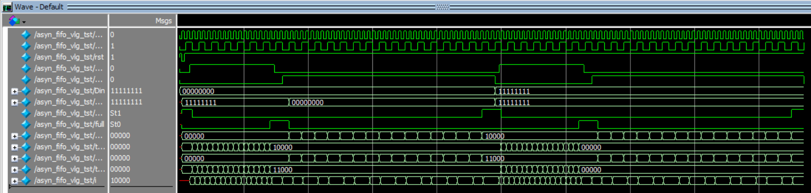

# 异步FIFO

## 1 实验要求

实现$8KB\times8$的异步FIFO。

## 2 理论实验

### 2.1 分析

### 2.2 代码

#### 2.2.1 模块代码

```verilog
`ifndef asyn_fifo
`define asyn_fifo

        module asyn_fifo #(
            parameter ADDR_WIDTH = 13, // 8KB
            parameter DATA_WIDTH = 8
        )(
            input wire clk_wr,
            input wire clk_rd,
            input wire rst,
            input wire en_wr,
            input wire en_rd,
            input wire[DATA_WIDTH-1:0] Din,
            output reg[DATA_WIDTH-1:0] Dout,
            output wire empty,
            output wire full,
            // test
            output reg[ADDR_WIDTH:0] head_bin,
            output reg[ADDR_WIDTH:0] tail_bin,
            output reg[ADDR_WIDTH:0] head_gray,
            output reg[ADDR_WIDTH:0] tail_gray
        );
/*----parameter----*/
parameter DATA_SIZE = 1 << ADDR_WIDTH;

/*----value----*/
reg[DATA_WIDTH-1:0] memory[DATA_SIZE-1:0];

// reg[ADDR_WIDTH:0] head_bin;
// reg[ADDR_WIDTH:0] tail_bin;
// reg[ADDR_WIDTH:0] head_gray;
// reg[ADDR_WIDTH:0] tail_gray;

wire[ADDR_WIDTH-1:0] head_addr;
wire[ADDR_WIDTH-1:0] tail_addr;

/*----assignment----*/
assign head_addr = head_bin[ADDR_WIDTH-1:0];
assign tail_addr = tail_bin[ADDR_WIDTH-1:0];
// TODO: a stable bin is needed to drive gray
assign empty = (head_gray == tail_gray);
/*
bin gray coin_gray
000 000 000
001 001 001
010 011 011
011 010 010
--- --- ---
100 110 100
101 111 101
110 101 111
111 100 110
*/
assign full = (
           (head_gray[ADDR_WIDTH:ADDR_WIDTH-1] == ~tail_gray[ADDR_WIDTH:ADDR_WIDTH-1]) &&
           (head_gray[ADDR_WIDTH-2:0] == tail_gray[ADDR_WIDTH-2:0])
       );

always @(posedge clk_wr, negedge rst) begin
	if(!rst) begin
		tail_bin <= 0;
		tail_gray <= 0;
	end
	else if(en_wr && !full) begin
		memory[tail_addr] <= Din;
		tail_bin <= tail_bin + 1;
		tail_gray <= bin2gray(tail_bin + 1);
	end
	else begin
		tail_bin <= tail_bin;
		tail_gray <= tail_gray;
	end
end

always @(posedge clk_rd, negedge rst) begin
	if(!rst) begin
		Dout <= ~0;
		head_bin <= 0;
		head_gray <= 0;
	end
	else if(en_rd && !empty) begin
		Dout <= memory[head_addr];
		head_bin <= head_bin + 1;
		head_gray <= bin2gray(head_bin + 1);
	end
	else begin
		Dout <= ~0;
		head_bin <= head_bin;
		head_gray <= head_gray;
	end
end

/*----function----*/
function [ADDR_WIDTH:0] bin2gray(input[ADDR_WIDTH:0] bin);
	bin2gray = bin ^ (bin >> 1);
endfunction
endmodule

`endif //`ifndef asyn_fifo
```

#### 2.2.2 仿真代码

``` verilog
`include "./asyn_fifo.v"

`define clk_cycle_wr 20
`define clk_cycle_rd 50

module asyn_fifo_vlg_tst;

/*----parameter----*/
parameter ADDR_WIDTH = 4;
parameter DATA_WIDTH = 8;

/*----value----*/
reg clk_wr;
reg clk_rd;
reg rst;
reg en_wr;
reg en_rd;
reg[DATA_WIDTH-1:0] Din;
wire[DATA_WIDTH-1:0] Dout;
wire empty;
wire full;

wire[ADDR_WIDTH:0] head_bin;
wire[ADDR_WIDTH:0] tail_bin;
wire[ADDR_WIDTH:0] head_gray;
wire[ADDR_WIDTH:0] tail_gray;

reg[ADDR_WIDTH:0] i;

/*----module----*/
asyn_fifo #(
              .ADDR_WIDTH(ADDR_WIDTH), // 8KB
              .DATA_WIDTH(DATA_WIDTH)
          ) uut (
              .clk_wr(clk_wr),
              .clk_rd(clk_rd),
              .rst(rst),
              .en_wr(en_wr),
              .en_rd(en_rd),
              .Din(Din),
              .Dout(Dout),
              .empty(empty),
              .full(full),
              // test
              .head_bin(head_bin),
              .tail_bin(tail_bin),
              .head_gray(head_gray),
              .tail_gray(tail_gray)
          );

/*----assignment----*/
always #`clk_cycle_wr clk_wr = ~clk_wr;
always #`clk_cycle_rd clk_rd = ~clk_rd;

initial begin
	clk_wr = 0;
	clk_rd = 0;
	rst = 1;
	en_wr = 0;
	en_rd = 0;
	Din = 0;
	#`clk_cycle_wr rst = 0;
	#`clk_cycle_wr rst = 1;

	/*----clear----*/
	$display("State: clearing memory...");
	@(negedge clk_wr)
	 en_wr = 1;
	i = 0;
	@(posedge clk_wr);
	while(!full) begin // memory置零
		@(negedge clk_wr)
		 i = i + 1;
		if(i > (1 << ADDR_WIDTH)) begin // full功能测试
			$display("Error: full is not work well.");
			$stop;
		end
		@(posedge clk_wr);
	end
	if(i != (1 << ADDR_WIDTH)) begin // full功能测试
		$display("Error: full is not work well.");
		$stop;
	end
	en_wr = 0;

	$display("State: memory is cleared, and then check clearing memory is cleared successfully");
	@(negedge clk_rd)
	 en_rd = 1;
	i = 0;
	@(posedge clk_rd);
	while(!empty) begin // memory置零
		@(negedge clk_wr)
		 i = i + 1;
		if(i > (1 << ADDR_WIDTH)) begin // empty功能测试
			$display("Error: empty is not work well.");
			$stop;
		end
		if(Dout != 0) begin
			$display("Error: memory is not cleared successfully.");
			$stop;
		end
		@(posedge clk_rd);
	end
	if(i != (1 << ADDR_WIDTH)) begin // empty功能测试
		$display("Error: empty is not work well.");
		$stop;
	end
	en_rd = 0;

	/*----set----*/
	Din = ~0;
	$display("State: setting memory...");
	@(negedge clk_wr);
	en_wr = 1;
	i = 0;
	@(posedge clk_wr);
	while(!full) begin // memory置零
		@(negedge clk_wr);
		i = i + 1;
		if(i > (1 << ADDR_WIDTH)) begin // full功能测试
			$display("Error: full is not work well.");
			$stop;
		end
		@(posedge clk_wr);
	end
	if(i != (1 << ADDR_WIDTH)) begin // full功能测试
		$display("Error: full is not work well.");
		$stop;
	end
	en_wr = 0;

	$display("State: memory is setted, and then check setting memory is setted successfully");
	@(negedge clk_rd);
	en_rd = 1;
	i = 0;
	@(posedge clk_rd);
	while(!empty) begin // memory置零
		@(negedge clk_wr);
		i = i + 1;
		if(i > (1 << ADDR_WIDTH)) begin // empty功能测试
			$display("Error: empty is not work well.");
			$stop;
		end
		if(Dout != {DATA_WIDTH{1'b1}}) begin
			$display("Error: memory is not setted successfully.");
			$stop;
		end
		@(posedge clk_rd);
	end
	if(i != (1 << ADDR_WIDTH)) begin // empty功能测试
		$display("Error: empty is not work well.");
		$stop;
	end
	en_rd = 0;

    $stop;
end

endmodule
```

### 2.3 仿真结果

因为电脑性能差和测试算法时间复杂度无法满足测试要求，所以缩减了内存容量。

#### 2.3.1 RTL仿真



```text
# State: clearing memory...
# State: memory is cleared, and then check clearing memory is cleared successfully
# State: setting memory...
# State: memory is setted, and then check setting memory is setted successfully
# ** Note: $stop    : C:/Users/CAESIUS/Desktop/test_git/asyn_fifo/asyn_fifo_vlg_tst.v(156)
#    Time: 4850 ps  Iteration: 1  Instance: /asyn_fifo_vlg_tst
# Break in Module asyn_fifo_vlg_tst at C:/Users/CAESIUS/Desktop/test_git/asyn_fifo/asyn_fifo_vlg_tst.v line 156
```

#### 2.3.2 门级仿真



```text
# State: clearing memory...
# State: memory is cleared, and then check clearing memory is cleared successfully
# State: setting memory...
# State: memory is setted, and then check setting memory is setted successfully
# ** Note: $stop    : C:/Users/CAESIUS/Desktop/test_git/asyn_fifo/asyn_fifo_vlg_tst.v(156)
#    Time: 4850 ps  Iteration: 1  Instance: /asyn_fifo_vlg_tst
# Break in Module asyn_fifo_vlg_tst at C:/Users/CAESIUS/Desktop/test_git/asyn_fifo/asyn_fifo_vlg_tst.v line 156
```

```verilog
assign empty = (head_gray == tail_gray);
```

因为使用了格雷码，所以仿真结果没有毛刺。

## 3 上机实验

### 3.1 分析


### 3.2 代码

```verilog

```

## 4 遇到的问题与解决方案
