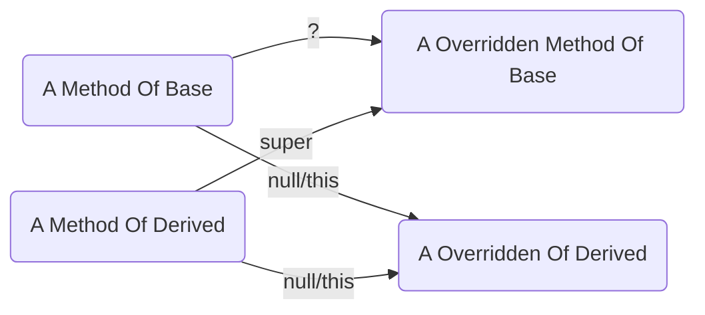

# 通过super调用父类方法，如果该父类方法调用了被重写过的方法

> 通过super调用父类方法，如果该父类方法调用了被重写过的方法，这些方法是原方法还是重写后的方法，与this关键字的修饰有没有关系？

## 部分程序与输出

### `public class StudentImpl implements Student`

```java
    @Override
    public String getInfo() {
        return "StudentImpl{" + //
                "id=" + id + //
                ", " + "name=" + name + //
                ", " + "grade=" + grade + //
                ", " + "classname=" + classname + //
                "}";
    }
    @Override
    public void info(Consumer<String> consumer) {
        if (consumer == null) {
            consumer = this.consumer;
        }
        consumer.accept(this.getInfo());
        consumer.accept(getInfo());
    }
```

### `public class Undergraduate extends StudentImpl`

```java
    @Override
    public String getInfo() {
        var str = super.getInfo();
        return str.substring(0, str.length() - 2) + //
                ", " + "college=" + college + //
                "}";
    }

    @Override
    public void info(Consumer<String> consumer) {
        super.info(consumer);
        System.out.println("use console to info");
    }
```

### `main`

```java
    public static void main(String[] args) {
        new StudentImpl(19001727, "Tim", "U2", "IE192").info();
    }
```

### 输出 

```text
StudentImpl{id=19001727, name=Tim, grade=U2, classname=IE19, college=IT}
StudentImpl{id=19001727, name=Tim, grade=U2, classname=IE19, college=IT}
use console to info
```

## 结论

> 通过super调用父类方法，如果该父类方法调用了被重写过的方法，这些方法是重写后的方法，与this关键字的修饰无关。

- 优点：可以有效的利用父类的重复逻辑。在被重写的方法中通过super调用原方法，可以在原方法的基础上增添新的逻辑（类似AOP），并通过重写原方法中调用的方法更新父类逻辑，从而实现多态性。
- 缺点：
  1. 产生了依赖，耦合性强。特殊需求（子类逻辑不需要一致）：通过super调用父类方法，如果该父类方法调用了被重写过的方法，如何保持这些方法是原方法？
  2. 如果在父类构造函数中调用被子类重写的方法，会导致子类重写的方法在子类构造器的所有代码之前执行，从而导致子类重写的方法访问不到子类实例变量的值，因为此时这些变量还没有被初始化。

## 新的问题

> 通过super调用父类方法，如果该父类方法调用了被重写过的方法，如何保持这些方法是原方法？

上述表面该原方法是有必要继续存在的，而重写的方法的实现逻辑与原方法不同，但是方法的签名是一致的，占用了原方法，所以是无法在父类中调用的（但是仍能在子类中通过super调用）。



重写的定义
> 重写是子类对父类的允许访问的方法的实现过程进行重新编写, 返回值和形参都不能改变。即外壳不变，核心重写！重写的好处在于子类可以根据需要，定义特定于自己的行为。 也就是说子类能够根据需要实现父类的方法。

1. 不要偷懒，在重写中分类讨论，根据不同的条件判断使用的是原方法还是新方法。
2. 尝试使用final，一了百了。
