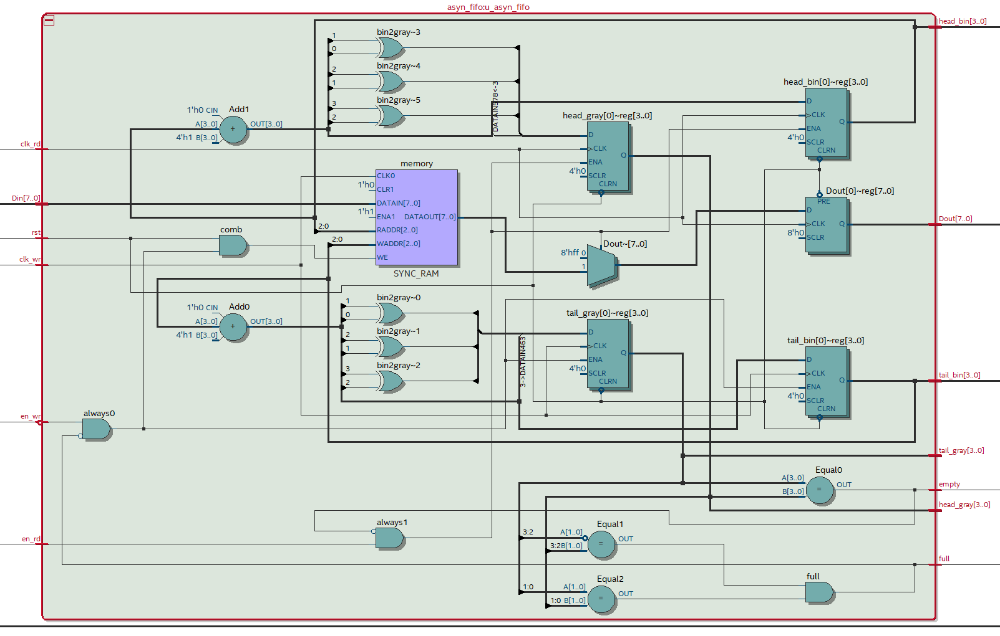
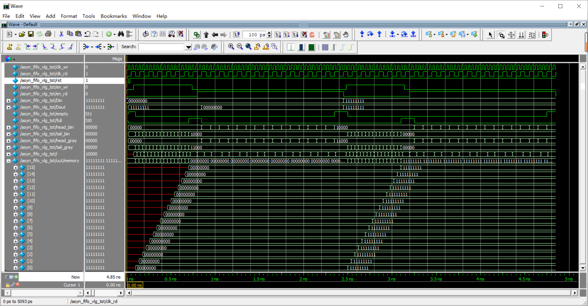
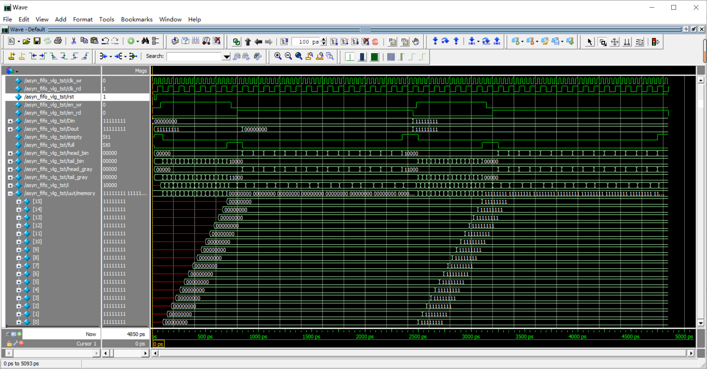
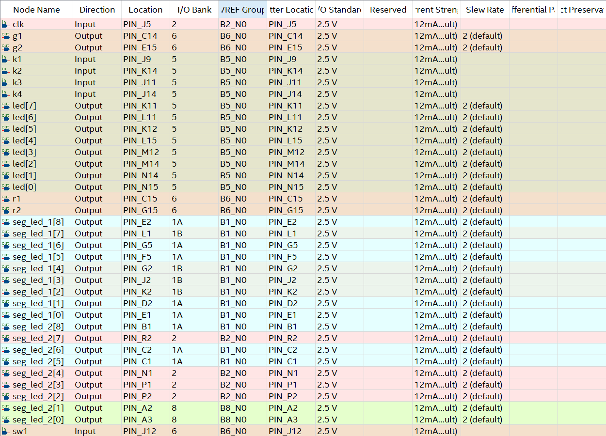

# 异步FIFO

## 1 实验要求

实现$8KB\times8$的异步FIFO。

## 2 理论实验

### 2.1 分析

数据结构的队列。因为异步，考虑到竞争冒险，最好是内存是二的幂数，头尾指针（head，tail）使用格雷码。

```c
typedef struct {
	int elem[MAX];
	int front;
	int rear;
}squene;
```

而寻址时仍然使用二进制，就需要在二进制转格雷码时，输入信号达到稳定，因此使用时钟控制的非阻塞方式赋值。

使用亦或的方法将二进制转格雷码：

```verilog
gray = bin ^ (bin >> 1);
```

但是要主要，如果字数设置不当，会导致溢出的1参与亦或运算，如：

```verilog
{0,0000} ^ {0,0000} = 0000
{1,0000} ^ {0,1000} = 1000
```

如果用尽内存，那么当队列为空时`head == tail`，队列为满时`head == (head + DATA_SIZE) % DATA_SIZE == tail`。所以一般的循环队列算法会舍弃一个字节，队列为满时`head == (head + 1 + DATA_SIZE) % DATA_SIZE == (tail + 1) % DATA_SIZE` 。

如果一个字节的子位很长，那么值得多用一位寄存器和一些电路去区分头尾指针的“正反面”：

```verilog
/*
// 2位字长
// 一般算法
bin gray2
00  00
01  01
10  11
11  10

// 区分“正反面”
bin gray3 {front_or_back,gray2}
000 000   000
001 001   001
010 011   011
011 010   010
--- ---   ---
100 110   100
101 111   101
110 101   111
111 100   110
*/
assign empty = (head_gray == tail_gray);

assign full = (
           (head_gray[ADDR_WIDTH:ADDR_WIDTH-1] == ~tail_gray[ADDR_WIDTH:ADDR_WIDTH-1]) &&
           (head_gray[ADDR_WIDTH-2:0] == tail_gray[ADDR_WIDTH-2:0])
       );
```


### 2.2 代码

#### 2.2.1 模块代码

```verilog
`ifndef asyn_fifo
`define asyn_fifo

        module asyn_fifo #(
            parameter ADDR_WIDTH = 13, // 8KB
            parameter DATA_WIDTH = 8
        )(
            input wire clk_wr,
            input wire clk_rd,
            input wire rst,
            input wire en_wr,
            input wire en_rd,
            input wire[DATA_WIDTH-1:0] Din,
            output reg[DATA_WIDTH-1:0] Dout,
            output wire empty,
            output wire full,
            // test
            output reg[ADDR_WIDTH:0] head_bin,
            output reg[ADDR_WIDTH:0] tail_bin,
            output reg[ADDR_WIDTH:0] head_gray,
            output reg[ADDR_WIDTH:0] tail_gray
        );
/*----parameter----*/
parameter DATA_SIZE = 1 << ADDR_WIDTH;

/*----value----*/
reg[DATA_WIDTH-1:0] memory[DATA_SIZE-1:0];

wire[ADDR_WIDTH-1:0] head_addr;
wire[ADDR_WIDTH-1:0] tail_addr;

/*----assignment----*/
assign head_addr = head_bin[ADDR_WIDTH-1:0];
assign tail_addr = tail_bin[ADDR_WIDTH-1:0];
// TODO: a stable bin is needed to drive gray
assign empty = (head_gray == tail_gray);
assign full = (
           (head_gray[ADDR_WIDTH:ADDR_WIDTH-1] == ~tail_gray[ADDR_WIDTH:ADDR_WIDTH-1]) &&
           (head_gray[ADDR_WIDTH-2:0] == tail_gray[ADDR_WIDTH-2:0])
       );

always @(posedge clk_wr, negedge rst) begin
	if(!rst) begin
		tail_bin <= 0;
		tail_gray <= 0;
	end
	else if(en_wr && !full) begin
		memory[tail_addr] <= Din;
		tail_bin <= tail_bin + 1;
		tail_gray <= bin2gray(tail_bin + 1);
	end
	else begin
		tail_bin <= tail_bin;
		tail_gray <= tail_gray;
	end
end

always @(posedge clk_rd, negedge rst) begin
	if(!rst) begin
		Dout <= ~0;
		head_bin <= 0;
		head_gray <= 0;
	end
	else if(en_rd && !empty) begin
		Dout <= memory[head_addr];
		head_bin <= head_bin + 1;
		head_gray <= bin2gray(head_bin + 1);
	end
	else begin
		Dout <= ~0;
		head_bin <= head_bin;
		head_gray <= head_gray;
	end
end

/*----function----*/
function [ADDR_WIDTH:0] bin2gray(input[ADDR_WIDTH:0] bin);
	bin2gray = bin ^ (bin >> 1);
endfunction
endmodule

`endif //`ifndef asyn_fifo
```

#### 2.2.2 仿真代码

先全赋值为0，全读取；再全赋值为~0，，全读取。

``` verilog
`include "./asyn_fifo.v"

`define clk_cycle_wr 20
`define clk_cycle_rd 50

module asyn_fifo_vlg_tst;

/*----parameter----*/
parameter ADDR_WIDTH = 4;
parameter DATA_WIDTH = 8;

/*----value----*/
reg clk_wr;
reg clk_rd;
reg rst;
reg en_wr;
reg en_rd;
reg[DATA_WIDTH-1:0] Din;
wire[DATA_WIDTH-1:0] Dout;
wire empty;
wire full;

wire[ADDR_WIDTH:0] head_bin;
wire[ADDR_WIDTH:0] tail_bin;
wire[ADDR_WIDTH:0] head_gray;
wire[ADDR_WIDTH:0] tail_gray;

reg[ADDR_WIDTH:0] i;

/*----module----*/
asyn_fifo #(
              .ADDR_WIDTH(ADDR_WIDTH), // 8KB
              .DATA_WIDTH(DATA_WIDTH)
          ) uut (
              .clk_wr(clk_wr),
              .clk_rd(clk_rd),
              .rst(rst),
              .en_wr(en_wr),
              .en_rd(en_rd),
              .Din(Din),
              .Dout(Dout),
              .empty(empty),
              .full(full),
              // test
              .head_bin(head_bin),
              .tail_bin(tail_bin),
              .head_gray(head_gray),
              .tail_gray(tail_gray)
          );

/*----assignment----*/
always #`clk_cycle_wr clk_wr = ~clk_wr;
always #`clk_cycle_rd clk_rd = ~clk_rd;

initial begin
	clk_wr = 0;
	clk_rd = 0;
	rst = 1;
	en_wr = 0;
	en_rd = 0;
	Din = 0;
	#`clk_cycle_wr rst = 0;
	#`clk_cycle_wr rst = 1;

	/*----clear----*/
	$display("State: clearing memory...");
	@(negedge clk_wr)
	 en_wr = 1;
	i = 0;
	@(posedge clk_wr);
	while(!full) begin // memory置零
		@(negedge clk_wr)
		 i = i + 1;
		if(i > (1 << ADDR_WIDTH)) begin // full功能测试
			$display("Error: full is not work well.");
			$stop;
		end
		@(posedge clk_wr);
	end
	if(i != (1 << ADDR_WIDTH)) begin // full功能测试
		$display("Error: full is not work well.");
		$stop;
	end
	en_wr = 0;

	$display("State: memory is cleared, and then check clearing memory is cleared successfully");
	@(negedge clk_rd)
	 en_rd = 1;
	i = 0;
	@(posedge clk_rd);
	while(!empty) begin // memory置零
		@(negedge clk_wr)
		 i = i + 1;
		if(i > (1 << ADDR_WIDTH)) begin // empty功能测试
			$display("Error: empty is not work well.");
			$stop;
		end
		if(Dout != 0) begin
			$display("Error: memory is not cleared successfully.");
			$stop;
		end
		@(posedge clk_rd);
	end
	if(i != (1 << ADDR_WIDTH)) begin // empty功能测试
		$display("Error: empty is not work well.");
		$stop;
	end
	en_rd = 0;

	/*----set----*/
	Din = ~0;
	$display("State: setting memory...");
	@(negedge clk_wr);
	en_wr = 1;
	i = 0;
	@(posedge clk_wr);
	while(!full) begin // memory置零
		@(negedge clk_wr);
		i = i + 1;
		if(i > (1 << ADDR_WIDTH)) begin // full功能测试
			$display("Error: full is not work well.");
			$stop;
		end
		@(posedge clk_wr);
	end
	if(i != (1 << ADDR_WIDTH)) begin // full功能测试
		$display("Error: full is not work well.");
		$stop;
	end
	en_wr = 0;

	$display("State: memory is setted, and then check setting memory is setted successfully");
	@(negedge clk_rd);
	en_rd = 1;
	i = 0;
	@(posedge clk_rd);
	while(!empty) begin // memory置零
		@(negedge clk_wr);
		i = i + 1;
		if(i > (1 << ADDR_WIDTH)) begin // empty功能测试
			$display("Error: empty is not work well.");
			$stop;
		end
		if(Dout != {DATA_WIDTH{1'b1}}) begin
			$display("Error: memory is not setted successfully.");
			$stop;
		end
		@(posedge clk_rd);
	end
	if(i != (1 << ADDR_WIDTH)) begin // empty功能测试
		$display("Error: empty is not work well.");
		$stop;
	end
	en_rd = 0;

    $stop;
end

endmodule
```

### 2.3 RTL Viewer



### 2.4 仿真结果

因为电脑性能差和测试算法时间复杂度无法满足测试要求，所以缩减了内存容量。

#### 2.4.1 RTL仿真



```text
# State: clearing memory...
# State: memory is cleared, and then check clearing memory is cleared successfully
# State: setting memory...
# State: memory is setted, and then check setting memory is setted successfully
# ** Note: $stop    : C:/Users/CAESIUS/Desktop/test_git/asyn_fifo/asyn_fifo_vlg_tst.v(156)
#    Time: 4850 ps  Iteration: 1  Instance: /asyn_fifo_vlg_tst
# Break in Module asyn_fifo_vlg_tst at C:/Users/CAESIUS/Desktop/test_git/asyn_fifo/asyn_fifo_vlg_tst.v line 156
```

#### 2.4.2 门级仿真



```text
# State: clearing memory...
# State: memory is cleared, and then check clearing memory is cleared successfully
# State: setting memory...
# State: memory is setted, and then check setting memory is setted successfully
# ** Note: $stop    : C:/Users/CAESIUS/Desktop/test_git/asyn_fifo/asyn_fifo_vlg_tst.v(156)
#    Time: 4850 ps  Iteration: 1  Instance: /asyn_fifo_vlg_tst
# Break in Module asyn_fifo_vlg_tst at C:/Users/CAESIUS/Desktop/test_git/asyn_fifo/asyn_fifo_vlg_tst.v line 156
```

因为使用了格雷码，所以门级仿真结果没有毛刺：

```verilog
assign empty = (head_gray == tail_gray);
```

## 3 上机实验

### 3.1 分析

#### 3.1.1 引脚及其功能分析

##### all

| name | pin                        | function                     |
| ---- | -------------------------- | ---------------------------- |
| CLK  | J5                         | clk                          |
| SW1  | J12                        | en_wr(0)/en_rd(1)            |
| K1   | J9                         | rst                          |
| K2   | K14                        | debounce -> clk_wr/clk_rd    |
| LED1 | red:C15; green:C14         | empty(green:0,red:1)         |
| LED2 | red:G15; green:E15         | full(green:0,red:1)          |
| SEG1 | E1,D2,K2,J2,G2,F5,G5,L1,E2 | tail(pos:dot-off,neg:dot-on) |

##### wr(SW1: 0)

| name | pin                        | function     |
| ---- | -------------------------- | ------------ |
| K3   | J11                        | 写Din时，写1 |
| K4   | J14                        | 写Din时，写0 |
| SEG2 | E1,D2,K2,J2,G2,F5,G5,L1,E2 | i            |

##### rd(SW1: 1)

| name    | pin     | function                     |
| ------- | ------- | ---------------------------- |
| SEG2    | omitted | head(pos:dot-off,neg:dot-on) |
| [1:8]LD | omitted | Dout                         |

### 3.2 代码

#### main

```verilog
`include "../debounce/debounce.v"
`include "../segment/segment.v"
`define EN_WR 0
`define EN_RD 1
module main_asyn_fifo#(
           parameter ADDR_WIDTH = 3, // 8KB
           parameter DATA_WIDTH = 8
       )(
           // extend
           input wire clk,
           input wire sw1,
           input wire k1,
           input wire k2,
           input wire k3,
           input wire k4,

           output wire [8:0]seg_led_1,
           output wire [8:0]seg_led_2,

           output wire g1,
           output wire r1,
           output wire g2,
           output wire r2,

           output [7:0] led
       );

/*----parameter----*/

/*----value----*/
wire clk_wr;
wire clk_rd;
wire rst;
wire en_wr;
wire en_rd;

reg[DATA_WIDTH-1:0] Din;
reg[DATA_WIDTH-1:0] Dout;
wire[DATA_WIDTH-1:0] Dout_wire;

wire empty;
wire full;

wire[ADDR_WIDTH:0] head_bin;
wire[ADDR_WIDTH:0] tail_bin;

reg[2:0] i;

wire [3:0]seg_data_1;
wire [3:0]seg_data_2;


wire en;
wire w1;
wire w0;

/*----module----*/
asyn_fifo #(
              .ADDR_WIDTH(ADDR_WIDTH), // 8KB
              .DATA_WIDTH(DATA_WIDTH)
          ) u_asyn_fifo (
              .clk_wr(clk_wr),
              .clk_rd(clk_rd),
              .rst(rst),
              .en_wr(en_wr),
              .en_rd(en_rd),
              .Din(Din),
              .Dout(Dout_wire),
              .empty(empty),
              .full(full),
              // test
              .head_bin(head_bin),
              .tail_bin(tail_bin),
              // .head_gray(head_gray),
              // .tail_gray(tail_gray)
          );

segment u_segment(
            .seg_data_1(seg_data_1),
            .seg_data_2(seg_data_2),
            .seg_led_1(seg_led_1[6:0]),
            .seg_led_2(seg_led_2[6:0])
        );

debounce #(
             .N(3)
         )u_debounce(
             .clk(clk),
             .rst(rst),
             .key({k2,k3,k4}),
             .key_pulse({en,w1,w0})
         );

/*----assignment----*/
assign rst = k1;

assign en_wr = (sw1 == `EN_WR);
assign en_rd = (sw1 == `EN_RD);

assign clk_wr = (sw1 == `EN_WR) ? en : 0;
assign clk_rd = (sw1 == `EN_RD) ? en : 0;

assign seg_data_1 = tail_bin[ADDR_WIDTH-1:0];
assign seg_data_2 = (sw1 == `EN_WR) ? i : head_bin[ADDR_WIDTH-1:0];
assign seg_led_1[8] = 0;
assign seg_led_2[8] = 0;
assign seg_led_1[7] = tail_bin[ADDR_WIDTH];
assign seg_led_2[7] = (sw1 == `EN_WR) ? 0 : head_bin[ADDR_WIDTH] ;

/* negative logic */
assign g1 = empty;
assign r1 = !empty;

assign g2 = full;
assign r2 = !full;

assign led = ~((sw1 == `EN_RD) ? Dout : Din);

always @(negedge clk, negedge rst) begin
	if(!rst) begin
		i <= 0;
		Din <= 0;
	end
	else if(w1 && (sw1 == `EN_WR)) begin
		i <= i + 1;
		Din[i] <= 1;
	end
	else if(w0 && (sw1 == `EN_WR)) begin
		i <= i + 1;
		Din[i] <= 0;
	end
	else begin
		i <= i;
		Din[i] <= Din[i];
	end

end

always @(negedge en,negedge rst) begin
	if(!rst) begin
		Dout <= 0;
	end
	else if(sw1 == `EN_RD) begin
		Dout <= Dout_wire;
	end
	else begin
		Dout <= Dout;
	end
end

endmodule
```

#### segment

```verilog
`ifndef segment
`define segment
module segment (seg_data_1,seg_data_2,seg_led_1,seg_led_2);
input [3:0] seg_data_1; //数码管需显示0~9，故需要4位输入做译码 
input [3:0] seg_data_2; //小脚丫上第二个数码管 
output [8:0] seg_led_1;
output [8:0] seg_led_2;
reg [8:0] seg [9:0];

/*
 __0__     
|     |
5     1      
|__6__|
|     |   
4     2        
|__3__| (7)
*/
initial begin 
    seg[0] = 9'h3f;
    seg[1] = 9'h06; 
    seg[2] = 9'h5b; 
    seg[3] = 9'h4f; 
    seg[4] = 9'h66; 
    seg[5] = 9'h6d; 
    seg[6] = 9'h7d; 
    seg[7] = 9'h07; 
    seg[8] = 9'h7f; 
    seg[9] = 9'h6f;
end
assign seg_led_1 = seg[seg_data_1];
assign seg_led_2 = seg[seg_data_2];
endmodule
`endif
```

#### debounce

```verilog
`ifndef debounce
`define debounce

module debounce 
#(
    parameter N = 1
)(
    input wire clk,
    input wire rst,
    input wire [N-1:0] key,
    output wire [N-1:0] key_pulse
); 

/*---------------------------------------------------------------------------*/
reg [N-1:0] key_rst; 
reg [N-1:0] key_rst_pre;
wire [N-1:0] key_edge;
/*---------------------------------------------------------------------------*/
reg [17:0] cnt;
/*---------------------------------------------------------------------------*/
reg [N-1:0] key_sec;
reg [N-1:0] key_sec_pre;
/*---------------------------------------------------------------------------*/
always @(posedge clk, negedge rst) begin 
    if (!rst) begin 
        key_rst <= {N{1'b1}};
        key_rst_pre <= {N{1'b1}};
    end else begin 
        key_rst <= key;
        key_rst_pre <= key_rst;
    end 
end 
/*---------------------------------------------------------------------------*/
assign key_edge = key_rst_pre & (~key_rst);
/*---------------------------------------------------------------------------*/
always @(posedge clk, negedge rst) begin 
    if(!rst)          cnt <= 18'h0;
    else if(key_edge) cnt <= 18'h0;
    else              cnt <= cnt + 1'h1;
end 
/*---------------------------------------------------------------------------*/
always @(posedge clk, negedge rst) begin 
    if (!rst)                key_sec <= {N{1'b1}};
    else if (cnt==18'h3ffff) key_sec <= key;
end

always @(posedge clk, negedge rst) begin 
    if (!rst) key_sec_pre <= {N{1'b1}};
    else      key_sec_pre <= key_sec; 
end 
/*---------------------------------------------------------------------------*/
assign key_pulse = key_sec_pre & (~key_sec); 
endmodule
`endif
```

### 3.3 引脚



### 3.4 上机结果

<video id="video" controls="">
    <source id="mp4" src="./assets/README/out.mp4" type="video/mp4">
</video>
